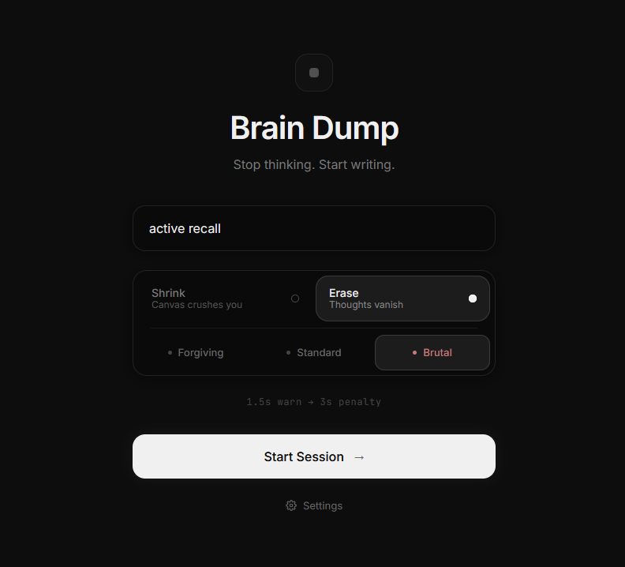
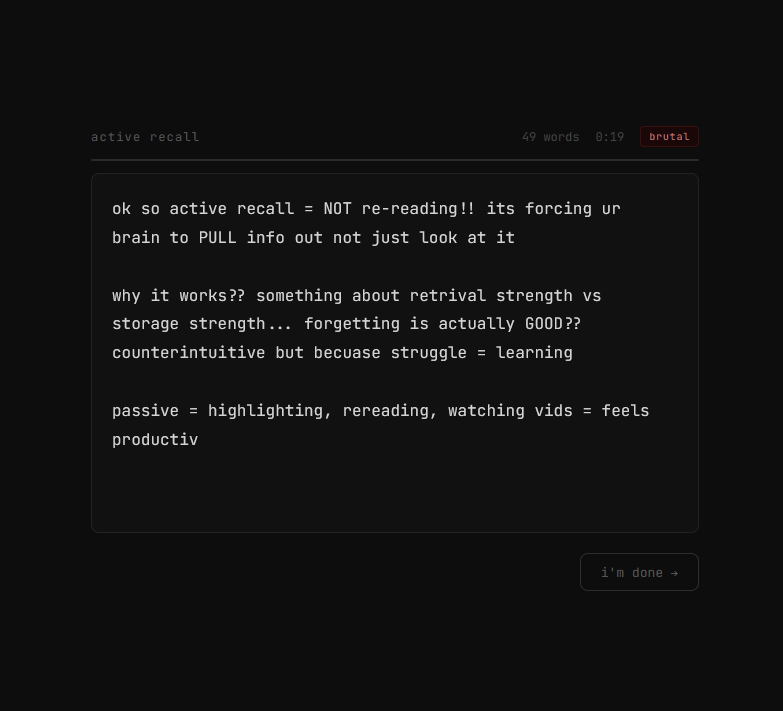

<div align="center">

# 🧠 Brain Dump

### Stop thinking. Start writing.

A distraction-free writing tool that keeps you in flow by punishing hesitation. If you stop typing, you lose your words.

[](https://react.dev)
[](https://www.typescriptlang.org)
[](https://tailwindcss.com)
[](https://vite.dev)

</div>

---

## 📸 Screenshots

<div align="center">

| Setup | Writing Session |
|:---:|:---:|
|  |  |

</div>

---

## ✨ What is this?

Brain Dump forces you to **write without stopping**. Choose a topic, pick your punishment mode, and start a session. The moment you pause too long, consequences kick in — your canvas shrinks, or your words start vanishing one by one.

It's designed to beat writer's block, capture raw ideas fast, and keep you locked in flow state.

---

## 🎮 Modes

| Mode | What happens when you stop |
|---|---|
| **Shrink** | The writing area slowly crushes down. If it disappears, the session ends. |
| **Erase** | Your words vanish letter by letter until you start typing again. |

## ⚡ Strictness Levels

| Level | Warning → Penalty |
|---|---|
| **Forgiving** | Generous pause window before consequences start |
| **Standard** | Balanced — a few seconds to think |
| **Brutal** | 1.5s warning → 3s penalty. No mercy. |

---

## 🚀 Getting Started

```bash
# Clone the repo
git clone https://github.com/Jimuelzxc/braindump.git
cd braindump

# Install dependencies
npm install

# Start the dev server
npm run dev
```

Open **[http://localhost:3000](http://localhost:3000)** in your browser and start writing.

---

## 🛠️ Tech Stack

- **React 19** — UI framework
- **TypeScript** — Type safety
- **Tailwind CSS v4** — Styling
- **Vite 6** — Build tool & dev server
- **Motion** — Animations
- **Lucide React** — Icons

---

## 💡 Why use Brain Dump?

- **Beat writer's block** — The pressure forces *something* onto the page
- **Capture raw ideas** — First thoughts, unfiltered, before your inner editor kicks in
- **Build a writing habit** — Short, intense sessions that compound over time
- **Stay focused** — High stakes = high attention

---

<div align="center">

*Made for people who want to write more and think less.*

</div>
